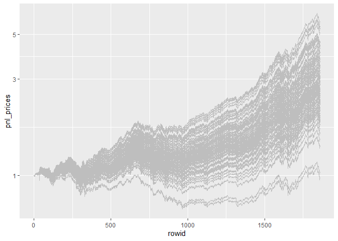

<!-- README.md is generated from README.Rmd. Please edit that file -->

# CMA

<!-- badges: start -->

[](https://github.com/Reckziegel/CMA/actions)
[](https://codecov.io/gh/Reckziegel/CMA?branch=main)
[](https://lifecycle.r-lib.org/articles/stages.html#experimental)

<!-- badges: end -->

> Multivariate Distribution = Marginals + Copulas

The Copula Marginal Algorithm (CMA) is a simple two step recipe to
manipulate multivariate distributions under [Fully Flexible
Probabilities](https://github.com/Reckziegel/FFP).

CMA can quickly decompose any multivariate distribution between unique
(*marginals*) and their shared components (*copulas*). This approach can
add a high level of flexibility for estimation and simulation purposes.

# Application 1: Panic Copulas

# Application 2: “What if” Analysis

Suppose we want to know what performances could be consistent with a
certain investment strategy. One could be tempted to bootstrap this
series, but if this route is taken, the dependency structure would
change too, which is not the ideal, since we full control over this
environment (our“market”).

One interesting way of solve this problem is via the Copula Marginal
Algorithm (CMA).

First, separate the marginals from the copulas. Second, generate a large
number of potential scenarios from a target distribution; and, finally,
“glue” these outputs back via the CMA combination step.

``` r
# load packages
library(cma)
library(tidyverse)

# compute log returns
x <- matrix(diff(log(EuStockMarkets)), ncol = 4)

# First CMA Step
step_one <- cma_separation(x)
step_one
#> # CMA Decomposition
#> marginal: << tbl 1859 x 4 >>
#> cdf     : << tbl 1859 x 4 >>
#> copula  : << tbl 1859 x 4 >>
```

Once the decomposition done, the student-t distribution is fitted to the
data (it could be *any* distribution):

``` r
dist_t <- fit_t(step_one$marginal)
dist_t
#> # Margins Estimation
#> Converged:       TRUE
#> Dimension:       4
#> AIC:            -52711.16
#> Log-Likelihood:  26374.58
#> Model:           Asymmetric Student-t
```

The next step requires some `tidyverse` skills. Start building the new
scenarios:

``` r
simul_tbl <- tibble(simulations = 1:100) |> 
    mutate(new_scenarios = map(
        .x = rep(1859, 100), 
        .f = ~ generate_margins(model = dist_t, n = .x)
        )
    )
simul_tbl
#> # A tibble: 100 x 2
#>    simulations new_scenarios  
#>          <int> <list>         
#>  1           1 <list<dbl> [1]>
#>  2           2 <list<dbl> [1]>
#>  3           3 <list<dbl> [1]>
#>  4           4 <list<dbl> [1]>
#>  5           5 <list<dbl> [1]>
#>  6           6 <list<dbl> [1]>
#>  7           7 <list<dbl> [1]>
#>  8           8 <list<dbl> [1]>
#>  9           9 <list<dbl> [1]>
#> 10          10 <list<dbl> [1]>
#> # ... with 90 more rows
```

The output of `new_scenarios()` is a list. It’s easy to pass over it
with the command bellow:

``` r
simul_tbl <- simul_tbl |> 
  mutate(new_scenarios = map(new_scenarios, 1))
simul_tbl
#> # A tibble: 100 x 2
#>    simulations new_scenarios       
#>          <int> <list>              
#>  1           1 <tibble [1,859 x 4]>
#>  2           2 <tibble [1,859 x 4]>
#>  3           3 <tibble [1,859 x 4]>
#>  4           4 <tibble [1,859 x 4]>
#>  5           5 <tibble [1,859 x 4]>
#>  6           6 <tibble [1,859 x 4]>
#>  7           7 <tibble [1,859 x 4]>
#>  8           8 <tibble [1,859 x 4]>
#>  9           9 <tibble [1,859 x 4]>
#> 10          10 <tibble [1,859 x 4]>
#> # ... with 90 more rows
```

Now we have a `tibble` with 100 simulations consistent with the
student-t distribution fitted in the object `dist_t`.

``` r
simul_tbl <- simul_tbl |> 
  mutate(cma_comb = map(
    .x = new_scenarios, 
    .f = ~ cma_combination(
      x      = .x,
      cdf    = step_one$cdf, 
      copula = step_one$copula
    ) 
  ), 
  weights = list(rep(0.25, 4))
  )
simul_tbl
#> # A tibble: 100 x 4
#>    simulations new_scenarios        cma_comb             weights  
#>          <int> <list>               <list>               <list>   
#>  1           1 <tibble [1,859 x 4]> <tibble [1,859 x 4]> <dbl [4]>
#>  2           2 <tibble [1,859 x 4]> <tibble [1,859 x 4]> <dbl [4]>
#>  3           3 <tibble [1,859 x 4]> <tibble [1,859 x 4]> <dbl [4]>
#>  4           4 <tibble [1,859 x 4]> <tibble [1,859 x 4]> <dbl [4]>
#>  5           5 <tibble [1,859 x 4]> <tibble [1,859 x 4]> <dbl [4]>
#>  6           6 <tibble [1,859 x 4]> <tibble [1,859 x 4]> <dbl [4]>
#>  7           7 <tibble [1,859 x 4]> <tibble [1,859 x 4]> <dbl [4]>
#>  8           8 <tibble [1,859 x 4]> <tibble [1,859 x 4]> <dbl [4]>
#>  9           9 <tibble [1,859 x 4]> <tibble [1,859 x 4]> <dbl [4]>
#> 10          10 <tibble [1,859 x 4]> <tibble [1,859 x 4]> <dbl [4]>
#> # ... with 90 more rows
```

``` r
simul_tbl <- simul_tbl |> 
  mutate(pnl = map2(.x = cma_comb, 
                    .y = weights, 
                    .f = ~ as.matrix(.x) %*% .y)) |> 
  select(-c(cma_comb, weights))
simul_tbl
#> # A tibble: 100 x 3
#>    simulations new_scenarios        pnl              
#>          <int> <list>               <list>           
#>  1           1 <tibble [1,859 x 4]> <dbl [1,859 x 1]>
#>  2           2 <tibble [1,859 x 4]> <dbl [1,859 x 1]>
#>  3           3 <tibble [1,859 x 4]> <dbl [1,859 x 1]>
#>  4           4 <tibble [1,859 x 4]> <dbl [1,859 x 1]>
#>  5           5 <tibble [1,859 x 4]> <dbl [1,859 x 1]>
#>  6           6 <tibble [1,859 x 4]> <dbl [1,859 x 1]>
#>  7           7 <tibble [1,859 x 4]> <dbl [1,859 x 1]>
#>  8           8 <tibble [1,859 x 4]> <dbl [1,859 x 1]>
#>  9           9 <tibble [1,859 x 4]> <dbl [1,859 x 1]>
#> 10          10 <tibble [1,859 x 4]> <dbl [1,859 x 1]>
#> # ... with 90 more rows
```

``` r
simul_tbl |> 
    mutate(pnl_prices = map(.x = pnl, .f = ~ cumprod(exp(.x)))) |> 
    unnest(cols = pnl_prices) |> 
  
    group_by(simulations) |> 
    mutate(rowid = 1:1859) |> 
    ungroup() |> 
  
    ggplot(aes(x = rowid, y = pnl_prices, group = simulations)) + 
    geom_line(col = "grey") + 
    scale_y_log10()
```


