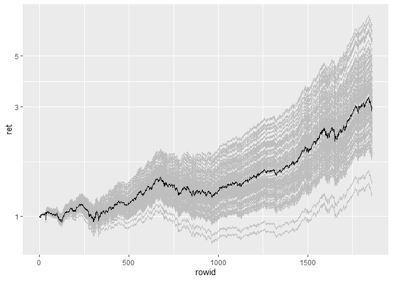

<!-- README.md is generated from README.Rmd. Please edit that file -->

# CMA

<!-- badges: start -->

[](https://github.com/Reckziegel/CMA/actions)
[](https://codecov.io/gh/Reckziegel/CMA?branch=main)
[](https://lifecycle.r-lib.org/articles/stages.html#experimental)

<!-- badges: end -->

> Multivariate Distribution = Marginals + Copulas

The Copula Marginal Algorithm (CMA) is a simple two step recipe to
manipulate multivariate distributions under [Fully Flexible
Probabilities](https://github.com/Reckziegel/FFP).

CMA can quickly decompose any multivariate distribution between unique
(*marginals*) and their shared components (*copulas*). This approach can
add a high level of flexibility for estimation and simulation purposes.

# Application 1: Panic Copulas

# Application 2: “What if” Analysis

Suppose you have an investment strategy and want to know different
outcomes compatible with the strategy. One way of doing this is
separating the marginals from the copulas, then generating large number
of potential scenarios and “glue” back this outcomes into the empirical
copula.

``` r
library(cma)
library(tidyverse)
#> -- Attaching packages --------------------------------------- tidyverse 1.3.1 --
#> v ggplot2 3.3.5     v purrr   0.3.4
#> v tibble  3.1.4     v dplyr   1.0.7
#> v tidyr   1.1.3     v stringr 1.4.0
#> v readr   2.0.1     v forcats 0.5.1
#> Warning: package 'tibble' was built under R version 4.1.1
#> Warning: package 'readr' was built under R version 4.1.1
#> -- Conflicts ------------------------------------------ tidyverse_conflicts() --
#> x dplyr::filter() masks stats::filter()
#> x dplyr::lag()    masks stats::lag()
# log returns
x <- matrix(diff(log(EuStockMarkets)), ncol = 4)

# First CMA Step
step_one <- cma_separation(x)
step_one
#> # CMA Decomposition
#> marginal: << tbl 1859 x 4 >>
#> cdf     : << tbl 1859 x 4 >>
#> copula  : << tbl 1859 x 4 >>
```

Now that we have the decomposition done, let’s generate 100 paths that
comes from the student-t distribution:

``` r
dist_t <- fit_t(step_one$marginal)
dist_t
#> # Margins Estimation
#> Converged:       TRUE
#> Dimension:       4
#> AIC:            -52711.16
#> Log-Likelihood:  26374.58
#> Model:           Asymmetric Student-t
```

``` r
scenarios <- purrr::map(
    .x = rep(1859, 100), 
    .f = ~ generate_margins(model = dist_t, n = .x)
)
map(.x = scenarios, 
    .y = step_one, 
    .f = ~ suppressWarnings(
        cma_combination(x = .x$marginal, cdf = .y$cdf, copula = .y$copula)
    ) 
) |> 
    map(as.matrix) |> 
    map(~ . %*% rep(0.25, 4)) |> 
    map(as_tibble, .name_repair = "minimal") |> 
    bind_rows() |> 
    mutate(simulation = rep(1:100, each = 1859)) |> 
    group_by(simulation) |> 
    mutate(rowid = 1:1859) |> 
    mutate(ret = cumprod(exp(...1)), original = cumprod(exp(x %*% rep(0.25, 4)))) |> 
    ungroup() |> 
    ggplot(aes(x= rowid, y = ret, group = simulation)) +
    geom_line(color = 'grey') + 
    geom_line(mapping = aes(y = original)) + 
    scale_y_log10()
#> New names:
#> * `` -> ...1
#> New names:
#> * `` -> ...1
#> New names:
#> * `` -> ...1
#> New names:
#> * `` -> ...1
#> New names:
#> * `` -> ...1
#> New names:
#> * `` -> ...1
#> New names:
#> * `` -> ...1
#> New names:
#> * `` -> ...1
#> New names:
#> * `` -> ...1
#> New names:
#> * `` -> ...1
#> New names:
#> * `` -> ...1
#> New names:
#> * `` -> ...1
#> New names:
#> * `` -> ...1
#> New names:
#> * `` -> ...1
#> New names:
#> * `` -> ...1
#> New names:
#> * `` -> ...1
#> New names:
#> * `` -> ...1
#> New names:
#> * `` -> ...1
#> New names:
#> * `` -> ...1
#> New names:
#> * `` -> ...1
#> New names:
#> * `` -> ...1
#> New names:
#> * `` -> ...1
#> New names:
#> * `` -> ...1
#> New names:
#> * `` -> ...1
#> New names:
#> * `` -> ...1
#> New names:
#> * `` -> ...1
#> New names:
#> * `` -> ...1
#> New names:
#> * `` -> ...1
#> New names:
#> * `` -> ...1
#> New names:
#> * `` -> ...1
#> New names:
#> * `` -> ...1
#> New names:
#> * `` -> ...1
#> New names:
#> * `` -> ...1
#> New names:
#> * `` -> ...1
#> New names:
#> * `` -> ...1
#> New names:
#> * `` -> ...1
#> New names:
#> * `` -> ...1
#> New names:
#> * `` -> ...1
#> New names:
#> * `` -> ...1
#> New names:
#> * `` -> ...1
#> New names:
#> * `` -> ...1
#> New names:
#> * `` -> ...1
#> New names:
#> * `` -> ...1
#> New names:
#> * `` -> ...1
#> New names:
#> * `` -> ...1
#> New names:
#> * `` -> ...1
#> New names:
#> * `` -> ...1
#> New names:
#> * `` -> ...1
#> New names:
#> * `` -> ...1
#> New names:
#> * `` -> ...1
#> New names:
#> * `` -> ...1
#> New names:
#> * `` -> ...1
#> New names:
#> * `` -> ...1
#> New names:
#> * `` -> ...1
#> New names:
#> * `` -> ...1
#> New names:
#> * `` -> ...1
#> New names:
#> * `` -> ...1
#> New names:
#> * `` -> ...1
#> New names:
#> * `` -> ...1
#> New names:
#> * `` -> ...1
#> New names:
#> * `` -> ...1
#> New names:
#> * `` -> ...1
#> New names:
#> * `` -> ...1
#> New names:
#> * `` -> ...1
#> New names:
#> * `` -> ...1
#> New names:
#> * `` -> ...1
#> New names:
#> * `` -> ...1
#> New names:
#> * `` -> ...1
#> New names:
#> * `` -> ...1
#> New names:
#> * `` -> ...1
#> New names:
#> * `` -> ...1
#> New names:
#> * `` -> ...1
#> New names:
#> * `` -> ...1
#> New names:
#> * `` -> ...1
#> New names:
#> * `` -> ...1
#> New names:
#> * `` -> ...1
#> New names:
#> * `` -> ...1
#> New names:
#> * `` -> ...1
#> New names:
#> * `` -> ...1
#> New names:
#> * `` -> ...1
#> New names:
#> * `` -> ...1
#> New names:
#> * `` -> ...1
#> New names:
#> * `` -> ...1
#> New names:
#> * `` -> ...1
#> New names:
#> * `` -> ...1
#> New names:
#> * `` -> ...1
#> New names:
#> * `` -> ...1
#> New names:
#> * `` -> ...1
#> New names:
#> * `` -> ...1
#> New names:
#> * `` -> ...1
#> New names:
#> * `` -> ...1
#> New names:
#> * `` -> ...1
#> New names:
#> * `` -> ...1
#> New names:
#> * `` -> ...1
#> New names:
#> * `` -> ...1
#> New names:
#> * `` -> ...1
#> New names:
#> * `` -> ...1
#> New names:
#> * `` -> ...1
#> New names:
#> * `` -> ...1
#> New names:
#> * `` -> ...1
```


